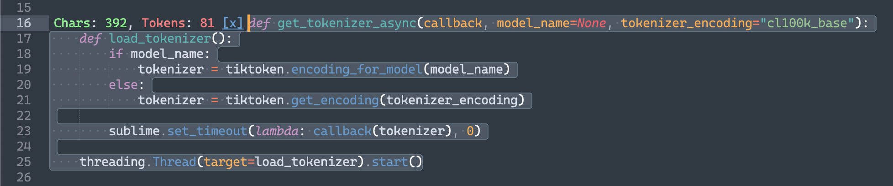

# Sublime [chatgpt] Token Counter

Pretty plain plugin that counts chars and tokens in selected text and presents it onscreen before the selection itself.

It has single command `"tokens_count"` that takes no attributes and toggling tokens count on a given selection in view. Multi-selections supported.
