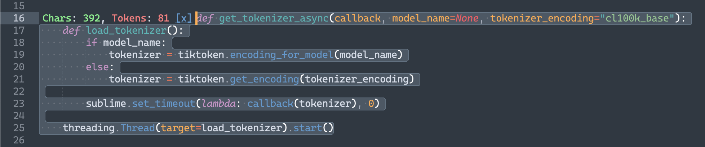

# Sublime [chatgpt] Token Counter

**Version 2.0.0 requires Sublime Text build 4205 or newer and runs in the Python 3.14 plugin host.**
Install with Package Control 4 so the required Python 3.14 libraries are installed.

Pretty plain plugin that counts chars and tokens in selected text and presents it onscreen before the selection itself.

It has single command `"tokens_count"` that takes no attributes and toggling tokens count on a given selection in view. Multi-selections supported.

Open **Preferences → Package Settings → Tokens Counter → Settings** to configure the counter.
Settings are read from `TokensCounter.sublime-settings`. A non-empty `model_name` takes
precedence over `tokenizer_encoding`. The default model is `gpt-4o`; to select an encoding
explicitly, set `"model_name": null` and choose `tokenizer_encoding`.
